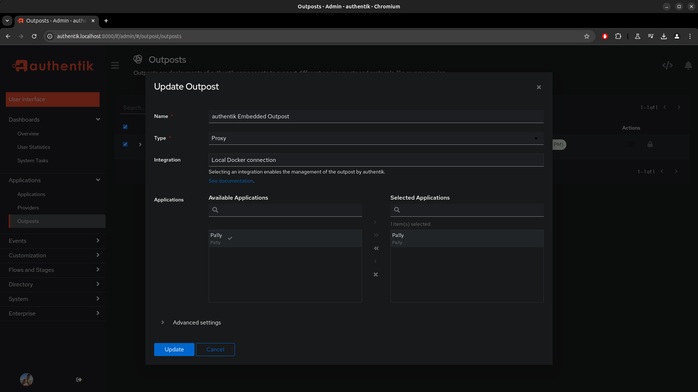

# Pa11y Dashboard Docker Container with authentik login

## Getting Started

Make sure you have [Docker installed](https://docs.docker.com/engine/install/). Clone or download this repository to your local machine, open up terminal, and then `cd docker-pa11y`.

Modify the `production.json` as needed for your desired [configuration options](https://github.com/pa11y/pa11y-dashboard#configurations)

Create a .env file with a Postgres password and secret key for the authentik IDP:

```
echo "PG_PASS=$(openssl rand -base64 36 | tr -d '\n')" >> .env
echo "AUTHENTIK_SECRET_KEY=$(openssl rand -base64 60 | tr -d '\n')" >> .env
```

Run `docker compose up -d` to begin building the Docker containers.


## Configuring Pa11y in authentik

Follow the initial authentik setup flow by navigating to http://authentik.localhost:8000/if/flow/initial-setup/, then add the P411y application to authentik.

Create a new Provider:
  * Navigate to Applications -> Providers and click the "Create" button
  * Choose type "Proxy Provider" and click "Next"
  * Give the new provider a name (i.e. "Pa11y")
  * Choose the "default-provider-authorization-implicit-consent" authorization flow
  * Choose "Forward auth (single application)", and set the External host to "http://pa11y.localhost:8000/"


Create a new Application:
  * Navigate to Applications -> Applications and click the "Create" button
  * Enter a Name and Slug for the new application (i.e. "Pa11y" and "pa11y")
  * For the Provider, choose the provider created in the previous step


Assign the new application to the embedded Outpost:
  * Navigate to Applications -> Outposts
  * Click the "Edit" icon in the same row as the "authentik Embedded Outpost"
  * Under "Available Applications", make sure the application you created is listed under "Selected Applications"



At this point, the Pa11y application should be shown on your user dashboard when viewing http://authentik.localhost:8000/


Clicking the tile should take you to the application dashboard at http://pa11y.localhost:8000/. If you attempt to open the application in an Incognito browser session (when not logged in), authentik should require login before allowing you to view the content of the dashboard.


## Uses
- [pa11y dashboard](https://github.com/pa11y/dashboard)
- [pa11y project](https://pa11y.org/)
- [docker](https://www.docker.com/products/docker)
- [authentik](https://goauthentik.io/)
